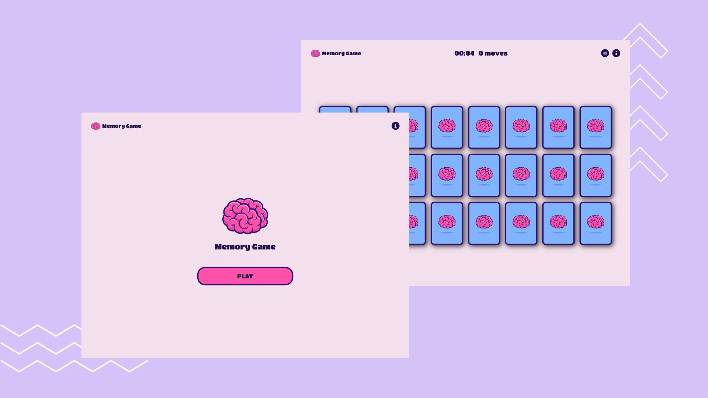

# Jogo da Memória

Bem-vindo ao Jogo da Memória! Este é um projeto desenvolvido em HTML, CSS e JavaScript, desafiando suas habilidades de memória e concentração. O objetivo é encontrar todos os pares de cartas correspondentes no menor tempo possível e com o menor número de movimentos.



## Funcionalidades

1. **Interface intuitiva**

      A interface do jogo é simples e intuitiva, proporcionando uma experiência agradável.

2. **Contador de movimentos**

      O jogo exibe um contador de movimentos para manter o controle de quantas jogadas foram feitas.

3. **Temporizador**

      Há também um temporizador que registra quanto tempo você leva para completar o jogo.

4. **Pause**

      Você pode pausar seu jogo e retornar assim que quiser.

## Como Jogar

1. Clone o repositório:

```bash
git clone https://github.com/isabellatressino/jogo-da-memoria.git
```

2. Abra o arquivo `index.html` no navegador de sua preferência.

    **ou**

    Acesse o [Jogo da Memória Online](https://isabellatressino.github.io/jogo-da-memoria/) para experimentar diretamente no seu navegador.

3. Jogue:
- Clique em duas cartas para virá-las.
- Se as cartas forem iguais, elas permanecerão viradas para cima. Caso contrário, elas serão viradas de volta após um breve momento.
- Continue virando as cartas até encontrar todos os pares correspondentes.

Divirta-se.
